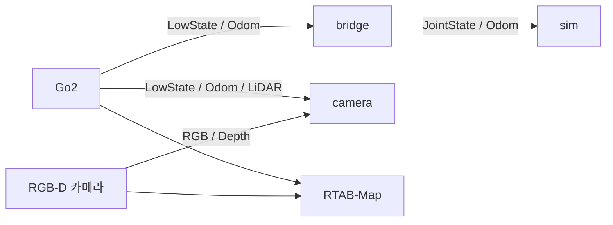

# Go2 Digital Twin & SLAM

실제 Go2 → Isaac Sim 시각화 · RTAB-Map 지도 생성

<a id="getting-started"></a>

## Quick Start

### 최초 설치

| 순서 | 준비할 항목 | 안내 |
| --- | --- | --- |
| 1 | Ubuntu 22.04 · ROS 2 Humble · 저장소 복제 | [Prerequisites](./docs/setup.md#prerequisites) |
| 2 | Python 3.11 · Isaac Sim 5.1 · Isaac Lab | [디지털 트윈 환경](./docs/setup.md#isaac) |
| 3 | Unitree 메시지 빌드 | [기능별 빌드](./docs/setup.md#messages) |
| 4 | 외부 Go2 URDF·mesh · PC별 경로 설정 | [모델 준비](./docs/setup.md#model) |
| 5 | Go2 네트워크 · 카메라 드라이버 · 수신 확인 | [센서 연결](./docs/setup.md#sensors) |

- SLAM만 사용: 2·4단계 생략 · 3단계의 SLAM 전용 빌드 선택
- 설치 후: 아래 모드 실행 · `camera` / `bridge + sim` 중 하나
- 경로: `~/isaac_ws` · 종료: 각 터미널에서 `Ctrl+C`

<a id="digital-twin"></a>

### Digital Twin · 카메라 포함

**터미널 1 — RealSense 드라이버** · 이미 `/camera/...` 발행 중이면 생략

```bash
source "$HOME/isaac_ws/scripts/env_ros2.sh"
ros2 launch realsense2_camera rs_launch.py \
  camera_namespace:=/ camera_name:=camera \
  enable_color:=true enable_depth:=true align_depth.enable:=true
```

**터미널 2 — Isaac Sim**

```bash
bash "$HOME/isaac_ws/go2_real/digital_twin/run.sh" camera
```

- 카메라 모드: 별도 관절 변환기 불필요
- 관절·자세·RGB 표시 / 뎁스·LiDAR 수신 진단

### Digital Twin · 관절·자세만

#### 터미널 1 — 변환기

```bash
bash "$HOME/isaac_ws/go2_real/digital_twin/run.sh" bridge
```

#### 터미널 2 — Isaac Sim

```bash
bash "$HOME/isaac_ws/go2_real/digital_twin/run.sh" sim
```

<a id="slam"></a>

### SLAM · RGB-D + LiDAR

```bash
source "$HOME/isaac_ws/scripts/env_ros2.sh"
ros2 launch "$HOME/isaac_ws/go2_real/slam/go2_slam.launch.py" \
  use_lidar:=true use_viz:=true
```

- 별도 시스템 ROS 터미널
- Go2·카메라 토픽 발행 후 실행 · [필수 입력 확인](./go2_real/slam/README.md#quick-start)
- RGB-D만 사용: `use_lidar:=false`

## 실행 영상

[](https://youtu.be/HpQZ3kfetH0)

<a id="topics"></a>

## 전체 구성



- 통신: ROS 2 / CycloneDDS
- 디지털 트윈·SLAM: 독립 실행

<a id="structure"></a>

## 상세 문서

| 문서 | 내용 |
| --- | --- |
| [디지털 트윈](./go2_real/digital_twin/README.md) | 실행 모드·토픽·센서 진단 |
| [SLAM](./go2_real/slam/README.md) | RViz·외부 LIO·지도 저장 |
| [환경 설정](./docs/setup.md) | 첫 설치·외부 저장소·메시지 빌드·센서 연결 |
| [이전 기록](./docs/archive/) | 과거 설정·실험 기록 |

<a id="troubleshooting"></a>

## 참고

- 라이선스: [unitree_go](./src/unitree_go/LICENSE)·[unitree_api](./src/unitree_api/LICENSE) — BSD 3-Clause / 프로젝트 전체 — 미지정
- 문의: [GitHub Issues](https://github.com/semin-Gwon/isaac_ws/issues)
