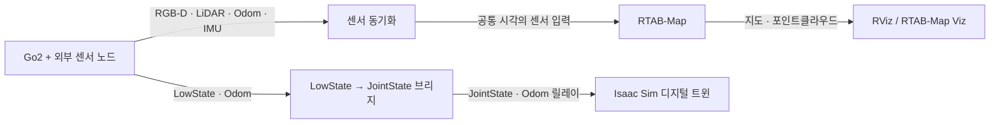

# Go2 SLAM & Isaac Sim Digital Twin


**실제 Unitree Go2의 센서 데이터를 ROS 2로 연결해 지도를 만들고, 로봇의 자세를 Isaac Sim에 재현하는 워크스페이스입니다.**

`isaac_ws`는 RGB-D·LiDAR·Odometry 입력을 동기화하는 Python 노드, RTAB-Map 실행 설정,
RViz 설정, 실제 로봇과 시뮬레이터를 연결하는 브리지를 포함합니다.
센서 간 시간 차이, ROS 메시지 형식, TF 좌표계, Python 실행 환경을 확인하며 통합 실험을 진행할 수 있도록 구성했습니다.

[시작하기](#getting-started) · [SLAM 실행](#slam) · [디지털 트윈](#digital-twin) ·
[토픽과 동기화](#topics) · [문제 해결](#troubleshooting) · [폴더 구조](#structure)

## 주요 기능

| 기능 | 구현 내용 | 주요 파일 |
| --- | --- | --- |
| 센서 동기화 | RGB 수신을 기준으로 Depth·LiDAR·Odometry를 매칭하고 공통 시각으로 재발행 | [`go2_topic_sync.py`](./go2_real/go2_topic_sync.py) |
| RGB-D SLAM | RTAB-Map 실행, RGB-D 포인트클라우드 생성, LiDAR 입력 선택 | [`go2_slam.launch.py`](./go2_real/go2_slam.launch.py) |
| LiDAR 기반 매핑 | 외부에서 동기화한 LiDAR·Odometry를 사용한 RTAB-Map ICP 설정 | [`go2_slam_lio.launch.py`](./go2_real/go2_slam_lio.launch.py) |
| 로봇 상태 브리지 | 12개 관절의 LowState를 필터링한 JointState로 변환, Odometry 릴레이 | [`ros2_bridge_server.py`](./go2_real/ros2_bridge_server.py) |
| Isaac Sim 시각화 | URDF를 불러와 관절·위치·방향을 갱신하고, 선택적으로 카메라 영상 표시 | [`go2_digital_twin.py`](./go2_real/go2_digital_twin.py), [`go2_visualize.py`](./go2_real/go2_visualize.py) |
| 지도 확인·가져오기 | RViz의 지도·이미지 표시와 RTAB-Map PLY의 USD Points 변환 | [`go2_sim.rviz`](./go2_real/go2_sim.rviz), [`go2_import_ply.py`](./go2_real/go2_import_ply.py) |

## 데이터 흐름



위 그림은 기본 SLAM과 관절 브리지를 사용하는 디지털 트윈의 흐름입니다.
SLAM은 Isaac Sim 없이 실행할 수 있고, 디지털 트윈은 SLAM 없이 로봇 상태를 표시할 수 있습니다.
LiDAR 전용 launch는 외부의 `*_synced` 입력을 직접 사용합니다.

로봇·카메라·LiDAR 드라이버, 외부 LIO 파이프라인, Go2 URDF와 메시 파일은 별도로 준비해야 합니다.
현재 저장소의 실행 코드는 상태 수신·매핑·시각화를 담당하며, 보행 제어나 강화학습 학습 파이프라인은 포함하지 않습니다.

<a id="getting-started"></a>

## 시작하기

### 1. 실행 환경

| 구분 | 필요한 환경 |
| --- | --- |
| SLAM·브리지 | Ubuntu 22.04, ROS 2 Humble, 시스템 Python 3.10, CycloneDDS |
| 매핑·시각화 | `rtabmap_ros`, `rviz2`, NumPy, OpenCV |
| 메시지 빌드 | `colcon`, `ament_cmake`, `rosidl_default_generators`, `rosidl_generator_dds_idl` |
| 디지털 트윈 선택 기능 | Isaac Sim, Isaac Lab의 `AppLauncher`, 호환되는 NVIDIA GPU·드라이버, Go2 URDF·메시 |

README 작성 시 로컬에서 확인한 설치는 Ubuntu 22.04.5, Python 3.10.12,
Isaac Sim `5.1.0.0`, Isaac Lab Python 패키지 `0.48.5`입니다.
Isaac Sim 환경의 Python은 3.11이며, 이 목록은 로컬 설치 정보입니다. 모든 기능의 호환성 시험 결과를 의미하지 않습니다.

ROS 2 설치는 [Humble 공식 설치 안내](https://docs.ros.org/en/humble/Installation/Ubuntu-Install-Debs.html),
시뮬레이터 설치는 [Isaac Lab 설치 안내](https://isaac-sim.github.io/IsaacLab/main/source/setup/installation/index.html)를 참고하세요.
Isaac Sim 5.x의 Python 3.11 환경과 시스템 ROS의 Python 3.10 환경을 구분해 사용합니다.

### 2. 저장소 복제 및 ROS 의존성 설치

다음은 ROS 2 Humble과 ROS apt 저장소가 이미 설정된 환경의 예제입니다.
SLAM·브리지 명령은 Conda 환경을 활성화하지 않은 시스템 ROS 터미널에서 실행합니다.

```bash
git clone https://github.com/semin-Gwon/isaac_ws.git "$HOME/isaac_ws"
cd "$HOME/isaac_ws"

sudo apt update
sudo apt install \
  build-essential cmake \
  python3-colcon-common-extensions python3-numpy python3-opencv \
  ros-humble-rtabmap-ros ros-humble-rviz2 \
  ros-humble-rmw-cyclonedds-cpp \
  ros-humble-rosidl-default-generators ros-humble-rosidl-generator-dds-idl \
  ros-humble-geometry-msgs ros-humble-nav-msgs ros-humble-sensor-msgs \
  ros-humble-tf2-ros ros-humble-tf2-msgs
```

RTAB-Map의 바이너리 설치 방법은 [공식 저장소 안내](https://github.com/introlab/rtabmap_ros#installation)를 따릅니다.
`go2_real/`의 스크립트는 독립 실행 파일이므로 이 폴더의 Python 의존성은 위 명령으로 별도 설치합니다.

### 3. Unitree 메시지 패키지 빌드

```bash
cd "$HOME/isaac_ws"
source /opt/ros/humble/setup.bash

colcon build --symlink-install --packages-select unitree_api unitree_go \
  --cmake-args -DPython3_EXECUTABLE=/usr/bin/python3

source install/local_setup.bash
ros2 interface show unitree_go/msg/LowState
```

`src/`의 두 패키지는 ROS 메시지 정의를 제공합니다.
`go2_real/`은 설치되는 ROS 패키지가 아니므로, launch 파일은 파일 경로로 실행하고 Python 노드는 직접 실행합니다.

### 4. 로컬 경로와 네트워크 설정

> [!IMPORTANT]
> 현재 코드에는 개발 PC의 `/home/jnu/...` 경로가 들어 있습니다.
> 다른 계정이나 디렉터리에서 실행할 때는 아래 경로를 먼저 수정해야 합니다.
> 예제에서 사용하는 `$HOME/isaac_ws`만 변경해도 소스 내부의 절대 경로가 자동으로 바뀌지는 않습니다.

| 위치 | 확인할 설정 |
| --- | --- |
| [`env_go2_slam.sh`](./env_go2_slam.sh) | 워크스페이스의 `install/local_setup.bash`, `cyclonedds.xml` 경로 |
| [`env_go2_visualize.sh`](./env_go2_visualize.sh) | 워크스페이스 및 Isaac Sim ROS 브리지 라이브러리 경로 |
| [`go2_slam.launch.py`](./go2_real/go2_slam.launch.py) | `topic_sync` 실행 명령 안의 워크스페이스·Python 스크립트 경로 |
| 두 Isaac Sim 시각화 스크립트 | `ros2_bridge_humble`의 Python 3.11 경로, `urdf_path` |
| [`go2_import_ply.py`](./go2_real/go2_import_ply.py) | 입력 PLY 경로: 기본값 `/home/jnu/.ros/rtabmap_cloud.ply` |
| [`cyclonedds.xml`](./cyclonedds.xml) | `NetworkInterfaceAddress`: 기본값 `eno1` |

시각화 스크립트가 참조하는 URDF 기본 경로는
`/home/jnu/go2_ws/src/go2_description/urdf/go2_description.urdf`입니다.
URDF가 참조하는 메시 파일까지 접근할 수 있어야 합니다.

`ip -br address`로 로봇에 연결된 인터페이스를 확인하고 `cyclonedds.xml`의 `eno1`을 맞춰 주세요.
현재 XML에는 특정 인터페이스만 지정되어 있으며, 정적 peer 주소는 정의되어 있지 않습니다.

경로 수정 후 SLAM·브리지용 터미널마다 다음을 실행합니다.

```bash
source "$HOME/isaac_ws/env_go2_slam.sh"
```

이 스크립트는 ROS 환경을 불러오고 `RMW_IMPLEMENTATION=rmw_cyclonedds_cpp`,
`ROS_DOMAIN_ID=0`, `ROS_LOCALHOST_ONLY=0`, `CYCLONEDDS_URI`, `ROS_LOG_DIR=/tmp/ros_logs`를 설정합니다.
통신하는 로봇·센서 노드와 PC 터미널은 같은 ROS domain을 사용해야 합니다.

<a id="slam"></a>

## SLAM 실행

입력 센서 노드는 별도로 실행되어 있어야 합니다. 사용할 센서 구성에 따라 아래 모드 중 하나를 선택합니다.
두 SLAM launch는 같은 `/rtabmap` 이름과 지도 토픽을 사용하므로 한 번에 하나씩 실행합니다.

### RGB-D + Odometry

LiDAR 없이 RGB-D 입력을 먼저 확인할 때 사용합니다.
launch는 IMU 구독도 켜므로, 연결된 IMU 토픽과 TF도 함께 확인하세요.

```bash
source "$HOME/isaac_ws/env_go2_slam.sh"
ros2 launch "$HOME/isaac_ws/go2_real/go2_slam.launch.py" \
  use_lidar:=false use_viz:=true
```

`topic_sync`, `point_cloud_xyzrgb`, RTAB-Map과 선택한 RTAB-Map Viz가 실행됩니다.
`topic_sync`를 별도로 실행할 필요는 없습니다.

### RGB-D + LiDAR + Odometry

```bash
source "$HOME/isaac_ws/env_go2_slam.sh"
ros2 launch "$HOME/isaac_ws/go2_real/go2_slam.launch.py" \
  use_lidar:=true use_viz:=true
```

`use_lidar`의 기본값은 **`true`**입니다.
이 모드에서는 시간 허용 범위 안의 LiDAR 메시지가 있어야 RGB-D 묶음도 발행됩니다.
RTAB-Map에는 RGB-D와 scan cloud가 함께 전달되며, 현재 `Reg/Strategy`는 `0`으로 설정되어 있습니다.

| `go2_slam.launch.py` 인자 | 기본값 | 동작 |
| --- | --- | --- |
| `use_lidar` | `true` | 동기화 묶음에 LiDAR를 요구하고 RTAB-Map의 scan cloud 구독 활성화 |
| `use_viz` | `false` | RTAB-Map Viz 실행 |
| `odom_eval_mode` | `false` | `true`이면 동기화 노드의 `odom → base_link` TF 발행을 생략; 외부 TF 필요 |

`use_sim_time`은 코드 내부에서 기본 `false`로 참조하지만, 이 launch의 선언된 인자 목록에는 없습니다.
실제 로봇의 시간을 사용하는 구성을 기준으로 합니다.

### 외부 LIO 입력을 사용하는 LiDAR 매핑

```bash
source "$HOME/isaac_ws/env_go2_slam.sh"
ros2 launch "$HOME/isaac_ws/go2_real/go2_slam_lio.launch.py" \
  use_lidar:=true use_viz:=true
```

이 launch는 RTAB-Map과 선택한 Viz만 실행합니다.
LIO 추정기나 동기화 노드를 시작하지 않으며, RGB-D 입력도 구독하지 않습니다.
`Reg/Strategy=1`의 ICP 등록과 `Reg/Force3DoF=true` 설정을 사용합니다.

외부 파이프라인에서 다음을 준비합니다.

- `/utlidar/cloud_deskewed_synced` — `sensor_msgs/msg/PointCloud2`
- `/utlidar/robot_odom_synced` — `nav_msgs/msg/Odometry`
- `odom → base_link`와 LiDAR 프레임을 연결하는 TF

`/utlidar/imu_synced` 리매핑도 있지만 현재 `subscribe_imu=False`입니다.
이 모드의 **`_synced`는 기본 동기화 노드가 발행하는 `_sync`와 다른 토픽**입니다.

선언된 인자는 `use_sim_time=false`, `use_viz=false`, `use_lidar=true`입니다.
여기서 `use_lidar=false`로 설정하면 RGB-D 모드로 바뀌는 것이 아니라 SLAM 노드가 실행되지 않습니다.

### RViz로 결과 확인

별도 시스템 ROS 터미널에서 실행합니다.

```bash
source "$HOME/isaac_ws/env_go2_slam.sh"
rviz2 -d "$HOME/isaac_ws/go2_real/go2_sim.rviz"
```

기본 Fixed Frame은 `map`입니다. `/map`, `/cloud_map`, `/rgbd_cloud`, 동기화한 RGB·Depth·Odometry를 표시합니다.
`LiDAR Cloud Sync` 디스플레이는 기본 비활성화되어 있습니다.
LIO 모드에서는 RGB-D 디스플레이를 끄고, LiDAR·Odometry 디스플레이의 토픽을 해당 모드의 입력에 맞춥니다.

<a id="topics"></a>

## 토픽과 동기화

아래는 [`go2_topic_sync.py`](./go2_real/go2_topic_sync.py)의 입력과 출력입니다.
여러 입력 이름은 구독 후보이며, 동일 센서의 여러 토픽이 동시에 발행되면 같은 버퍼에 들어갑니다.

| 데이터 | 입력 토픽 | 출력 토픽 |
| --- | --- | --- |
| RGB raw | `/my_go2/color/image_raw`, `/camera/color/image_raw` | `/my_go2/color/image_raw_sync` |
| RGB compressed | 위 두 RGB 토픽의 `/compressed` | 같은 RGB raw 출력으로 디코딩 |
| Depth raw | `/my_go2/depth/image_rect_raw`, `/camera/depth/image_rect_raw` | `/my_go2/depth/image_rect_raw_sync` |
| CameraInfo | `/my_go2/color/camera_info`, `/camera/color/camera_info`, `/camera/camera_info` | `/my_go2/color/camera_info_sync` |
| Odometry | `/utlidar/robot_odom`, `/my_go2/robot_odom`, `/uslam/localization/odom`, `/uslam/frontend/odom` | `/utlidar/robot_odom_sync` |
| LiDAR | `/utlidar/cloud`, `/utlidar/cloud_deskewed`, `/utlidar/cloud_base` | `/utlidar/cloud_sync` |
| IMU | `/utlidar/imu`, `/imu/data`, `/my_go2/imu` | `/utlidar/imu_sync` |

RGB가 도착하면 버퍼의 가장 가까운 Depth·LiDAR·Odometry를 찾습니다.
Depth는 **80 ms**, LiDAR는 **150 ms**, Odometry는 **100 ms**를 기준으로 매칭합니다.
Odometry가 100 ms 안에 없으면 버퍼에 남아 있는 최신 메시지를 사용하므로, 이는 엄격한 시간 차이 상한이 아닙니다.
버퍼의 시간 유지 범위는 2초이며 메시지 개수도 제한합니다.

유효한 묶음의 RGB·Depth·CameraInfo·LiDAR·Odometry는 선택한 Odometry 시각을 공유합니다.
IMU는 별도 콜백에서 재발행하며 이 묶음의 매칭 대상에 포함되지 않습니다.
동기화된 Odometry도 묶음 발행 시 나가기 때문에 RGB-D 입력이 없으면 출력이 멈출 수 있습니다.

현재 카메라 좌표계는 다음과 같습니다.

```text
map → odom → base_link → camera_link → camera_optical_frame
```

`map → odom`은 RTAB-Map, `odom → base_link`는 기본 모드의 동기화 노드가 담당합니다.
카메라 변환은 코드에 고정되어 있으며 `base_link → camera_link`의 이동량은 `(0.3, 0.0, 0.1) m`입니다.
실제 장착 위치와 캘리브레이션에 맞게 조정하세요.

CameraInfo를 받으면 그 값을 사용하고, 없으면 640×480 기준의 근사 내부 파라미터를 만들어 사용합니다.
Depth는 raw `Image` 입력만 구독합니다. `passthrough` 인코딩은 `step`을 보고 `16UC1` 또는 `32FC1`로 바꾸지만,
영상 정합이나 깊이 값의 단위 변환까지 수행하지는 않습니다.

<a id="digital-twin"></a>

## Isaac Sim 디지털 트윈

### 관절·자세 동기화

[`ros2_bridge_server.py`](./go2_real/ros2_bridge_server.py)는 `/lf/lowstate`를 받아
저역 통과 필터와 deadband를 적용한 `/joint_states`를 발행합니다.
관절 순서는 FR → FL → RR → RL이며 각 다리의 hip·thigh·calf를 사용합니다.
최대 발행률 설정은 120 Hz이고, `position`만 전달합니다.
Odometry는 `/utlidar/robot_odom`에서 `/my_go2/robot_odom`으로 릴레이합니다.

**터미널 A — 시스템 ROS 브리지**

```bash
source "$HOME/isaac_ws/env_go2_slam.sh"
/usr/bin/python3 "$HOME/isaac_ws/go2_real/ros2_bridge_server.py"
```

**터미널 B — Isaac Sim / Isaac Lab 환경**

먼저 두 시각화 스크립트의 `ros2_bridge_humble`과 `urdf_path`를 맞춥니다.
다음은 Python 3.11 Conda 환경 `isaaclab`에 Isaac Sim을 pip 설치한 경우의 예제입니다.
시스템 ROS를 source하지 않은 별도 터미널에서 실행합니다.

```bash
conda activate isaaclab

export ROS_DISTRO=humble
export RMW_IMPLEMENTATION=rmw_cyclonedds_cpp
export ROS_DOMAIN_ID=0
export ROS_LOCALHOST_ONLY=0
export CYCLONEDDS_URI="file://$HOME/isaac_ws/cyclonedds.xml"
export ISAAC_ROS_BRIDGE="$CONDA_PREFIX/lib/python3.11/site-packages/isaacsim/exts/isaacsim.ros2.bridge/humble"
export LD_LIBRARY_PATH="$ISAAC_ROS_BRIDGE/lib${LD_LIBRARY_PATH:+:$LD_LIBRARY_PATH}"

python "$HOME/isaac_ws/go2_real/go2_digital_twin.py"
```

스크립트가 `AppLauncher`로 Isaac Sim을 시작하고, `/joint_states` 및 Odometry로 가상 로봇의 관절과 자세를 갱신합니다.
Isaac Sim의 Python 3.11용 ROS 내부 라이브러리와 CycloneDDS 설정은
[NVIDIA ROS 2 설치 안내](https://docs.isaacsim.omniverse.nvidia.com/5.1.0/installation/install_ros.html)를 참고하세요.
`env_go2_visualize.sh`는 시스템 ROS 경로까지 불러오는 기존 환경용 스크립트이므로 Python 환경 구성을 확인한 뒤 사용합니다.

### 카메라 화면을 포함하는 시각화

같은 시뮬레이터 환경에서 `go2_visualize.py`를 선택할 수 있습니다.
이 스크립트는 `/lf/lowstate`를 직접 구독하므로 **Isaac Sim의 Python 버전으로 빌드한 `unitree_go`**도 필요합니다.
앞서 시스템 Python 3.10으로 빌드한 메시지를 Python 3.11에서 그대로 사용할 수는 없습니다.

```bash
# Python 3.11용 unitree_go와 시뮬레이터 환경 설정 후 실행
python "$HOME/isaac_ws/go2_real/go2_visualize.py"
```

영상 입력은 `/my_go2/color/image_raw_sync`이며, 가상 스크린 텍스처를 갱신합니다.
Pillow가 없으면 OpenCV로 이미지를 저장합니다.
이 스크립트와 `go2_digital_twin.py`는 모두 `/tmp/go2.usd`를 생성하므로 하나를 선택해서 사용합니다.

브리지도 Odometry 기반 TF를 발행합니다.
SLAM과 함께 사용할 때는 동기화 노드·브리지·외부 추정기가 같은 `odom → base_link`를 중복 발행하지 않도록 구성해야 합니다.
`odom_eval_mode=true`는 동기화 노드의 TF 발행만 끄며, TF 소스를 자동으로 선택하거나 조정하지 않습니다.

### PLY 지도를 Isaac Sim으로 가져오기

RTAB-Map에서 내보낸 PLY의 경로를 `go2_import_ply.py`의 `ply_file_path`에 지정하고,
Isaac Sim의 열린 stage에서 Script Editor로 실행합니다.
스크립트는 `/World/rtabmap_cloud`에 `UsdGeom.Points`를 생성합니다.

현재 파서는 little-endian binary PLY의
`x, y, z, red, green, blue, nx, ny, nz, curvature` 순서와 31-byte vertex 구조를 가정합니다.
ASCII PLY나 다른 필드 구성의 파일에는 파서 수정이 필요합니다.

<a id="troubleshooting"></a>

## 실행 확인과 문제 해결

SLAM을 실행한 뒤 별도 시스템 ROS 터미널에서 입력·출력·TF를 확인합니다.
`hz`와 `tf2_echo`는 계속 실행되므로 각 명령 확인 후 `Ctrl+C`로 종료합니다.

```bash
source "$HOME/isaac_ws/env_go2_slam.sh"

ros2 node list
ros2 node info /rtabmap
ros2 topic hz /my_go2/color/image_raw_sync
ros2 topic hz /my_go2/depth/image_rect_raw_sync
ros2 topic hz /utlidar/robot_odom_sync
ros2 topic hz /utlidar/cloud_sync
ros2 run tf2_ros tf2_echo base_link camera_optical_frame
ros2 run tf2_ros tf2_echo map base_link
```

`/utlidar/cloud_sync` 검사는 기본 launch의 LiDAR 활성 모드에서 사용합니다.
LIO 모드에서는 위 검사 토픽을 `_synced` 입력으로 바꿉니다.
`/rgbd_cloud`는 현재 RGB-D 입력으로 만든 클라우드이고, `/cloud_map`은 RTAB-Map 지도 출력입니다.

| 증상 | 확인할 내용 |
| --- | --- |
| `No module named unitree_go` | 메시지 패키지 빌드, `install/local_setup.bash`, 실행 Python과 메시지 빌드 버전 |
| `No module named rclpy` 또는 공유 라이브러리 오류 | 시스템 ROS와 Isaac Sim의 Python 경로 혼합 여부, 브리지 라이브러리 경로 |
| DDS 인터페이스 오류·토픽 미수신 | `cyclonedds.xml`의 인터페이스, 로봇 연결, domain·RMW 설정 |
| `Did not receive data` | 선택한 모드의 입력 토픽, 시간 차이, `[diag]`의 `sync_success`·`sync_drop` |
| LiDAR 없이 RGB-D 출력까지 멈춤 | 기본 `use_lidar=true` 여부; RGB-D 모드는 `use_lidar:=false`로 실행 |
| TF 단절·자세 튐 | 현재 `camera_optical_frame` 이름, 센서 외부 파라미터, 중복 TF 발행자 |
| RViz에 클라우드가 안 보임 | `map` TF, 선택한 모드의 토픽, 디스플레이 활성화·QoS |
| `rosidl_generator_dds_idl` 빌드 오류 | `ros-humble-rosidl-generator-dds-idl` 설치 여부 |

이 README는 현재 소스, 로컬 설치 정보, launch 인자 조회를 기준으로 작성했습니다.
이번 문서화에서는 실제 로봇을 연결한 SLAM·시뮬레이터 실행이나 매핑 정확도·지연 시간 측정을 수행하지 않았습니다.

<a id="structure"></a>

## 저장소 구조

```text
isaac_ws/
├── README.md
├── go2_real/
│   ├── go2_topic_sync.py          # 센서 버퍼·시간 매칭·TF
│   ├── go2_slam.launch.py         # RGB-D 및 LiDAR 선택 실행
│   ├── go2_slam_lio.launch.py     # 외부 LIO 입력의 RTAB-Map 실행
│   ├── ros2_bridge_server.py     # LowState → JointState·Odom 릴레이
│   ├── go2_digital_twin.py       # 관절·자세 디지털 트윈
│   ├── go2_visualize.py          # 로봇·카메라 스크린 시각화
│   ├── go2_import_ply.py         # PLY → USD Points
│   └── go2_sim.rviz              # 지도·이미지·TF 디스플레이
├── src/
│   ├── unitree_api/              # API 메시지 8종
│   └── unitree_go/               # 로봇 상태·센서 메시지 26종
├── cyclonedds.xml
├── env_go2_slam.sh
├── env_go2_visualize.sh
├── GO2_RTABMAP_GUIDE.md
├── GO2_ISAACSIM_ROS2_GUIDE.md
├── TASKS.md
└── plan.md
```

### 생성 파일 관리

두 SLAM launch는 `go2_real/maps/`를 자동 생성하고 다음 DB 경로를 사용합니다.

| 실행 모드 | 지도 DB |
| --- | --- |
| 기본 RGB-D / RGB-D + LiDAR | `go2_real/maps/rtabmap_real.db` |
| 외부 LIO 입력 | `go2_real/maps/rtabmap_real_lio.db` |

기본 launch의 두 센서 모드는 같은 DB를 사용합니다.
실험별 지도를 보존하려면 RTAB-Map 종료 후 DB를 백업하고, 새 실험의 경로를 launch에서 지정하세요.

빌드 결과 `build/`, `install/`, 로그 `log/`, Hydra 결과 `outputs/`,
다운로드한 `.pretrained_checkpoints/`, 생성한 `generated/`, Python 캐시,
지도 DB·내보낸 PLY/PCD와 ROS bag은 [`.gitignore`](./.gitignore)로 제외합니다.
이 파일들은 GitHub에서 복제되지 않으므로 필요한 경우 로컬에서 다시 빌드·생성합니다.

## 관련 문서

| 문서 | 용도 |
| --- | --- |
| [`GO2_RTABMAP_GUIDE.md`](./GO2_RTABMAP_GUIDE.md) | RTAB-Map 통합 과정과 이전 운영 기록 |
| [`GO2_ISAACSIM_ROS2_GUIDE.md`](./GO2_ISAACSIM_ROS2_GUIDE.md) | ROS·Isaac Sim 환경 분리의 배경과 이전 브리지 구성 |
| [`plan.md`](./plan.md) | RGB-D·LiDAR 묶음 동기화의 설계 계획 |
| [`TASKS.md`](./TASKS.md) | 과거 작업 항목과 진행 기록 |

기존 문서에는 현재 없는 `go2_delay.py`나 루트의 `go2_sim.rviz`,
이전 프레임 이름 `my_go2_color_optical_frame` 등의 설명이 남아 있습니다.
현재 실행 파일·토픽·경로는 이 README와 `go2_real/`의 소스를 기준으로 확인하세요.

## 라이선스와 문의

저장소 루트에는 프로젝트 전체에 적용하는 라이선스 파일이 아직 없습니다.
포함된 Unitree 메시지 패키지는 각각
[`unitree_api/LICENSE`](./src/unitree_api/LICENSE),
[`unitree_go/LICENSE`](./src/unitree_go/LICENSE)의 BSD 3-Clause 조건을 따릅니다.

문제나 개선 제안은 [GitHub Issues](https://github.com/semin-Gwon/isaac_ws/issues)에 남겨 주세요.
사용한 launch와 인자, ROS·Python·Isaac Sim 버전, 입력 토픽과 관련 로그를 함께 기록하면 재현에 도움이 됩니다.
