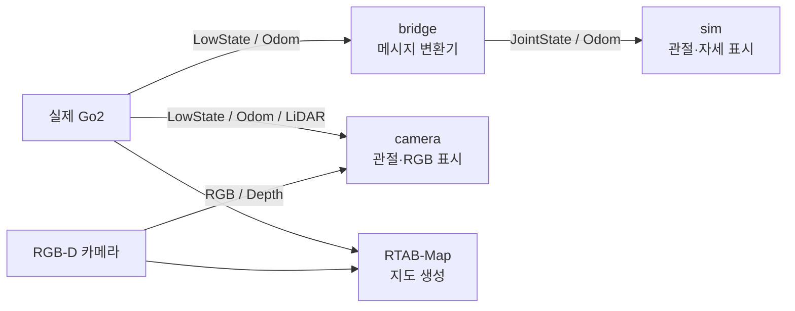

# Go2 Digital Twin & SLAM


**실제 Go2를 Isaac Sim에 재현하고, 센서 데이터로 지도를 만드는 프로젝트입니다.**

- **디지털 트윈:** 관절·자세와 RGB 화면을 표시하고, 뎁스·LiDAR 수신 상태를 확인합니다.
- **SLAM:** 카메라·LiDAR 데이터를 사용해 RTAB-Map으로 지도를 만듭니다.

<a id="topics"></a>

## 전체 구성



ROS 2 / CycloneDDS로 연결합니다. 디지털 트윈과 SLAM은 각각 독립적으로 실행할 수 있습니다.

<a id="getting-started"></a>

## 실행 준비

명령은 저장소가 `~/isaac_ws`에 있고, 필요한 라이브러리·모델이 설치된 환경을 기준으로 합니다.

| 기능 | 필요한 환경 |
| --- | --- |
| 디지털 트윈 | Conda `isaaclab`, Python 3.11, Isaac Sim·Isaac Lab, Python 3.11용 Unitree 메시지·Go2 URDF |
| SLAM | Ubuntu 22.04, ROS 2 Humble, Python 3.10, RTAB-Map·센서 드라이버 |

처음 설치한다면 **[환경 준비 안내](./docs/setup.md)**를 먼저 확인하세요.
디지털 트윈의 라이브러리 설치 상태는 다음 명령으로 확인합니다.

```bash
bash "$HOME/isaac_ws/go2_real/digital_twin/run.sh" check
```

<a id="digital-twin"></a>

## 디지털 트윈

**`camera`와 `sim` 중 하나를 선택합니다.** 관절 메시지를 받는 방식이 다릅니다.

| 모드 | 관절 입력 | 별도 변환기 |
| --- | --- | --- |
| `camera` — 관절·자세 + RGB 화면 | `/lf/lowstate`의 `LowState` 직접 해석 | 필요 없음 |
| `sim` — 관절·자세 | `/joint_states`의 `JointState` | `bridge` 실행 필요 |

### 카메라 포함 — 터미널 한 개

```bash
bash "$HOME/isaac_ws/go2_real/digital_twin/run.sh" camera
```

RGB 입력은 `/camera/color/image_raw`이며, 스크린은 로봇 앞에서 로봇 쪽을 향합니다.
뎁스·LiDAR는 **수신·진단 로그까지 지원**하며, 해당 데이터의 화면 표시는 아직 구현하지 않았습니다.

### 관절·자세만 — 터미널 두 개

**터미널 1 — 변환기**

```bash
bash "$HOME/isaac_ws/go2_real/digital_twin/run.sh" bridge
```

**터미널 2 — Isaac Sim**

```bash
bash "$HOME/isaac_ws/go2_real/digital_twin/run.sh" sim
```

모든 명령은 환경을 자동 설정합니다. 종료는 각 터미널에서 `Ctrl+C`입니다.

[디지털 트윈 상세 안내 →](./go2_real/digital_twin/README.md)

<a id="slam"></a>

## SLAM

별도 시스템 ROS 터미널에서 실행합니다. 센서 입력과 좌표계 설정이 먼저 준비되어 있어야 합니다.

```bash
source "$HOME/isaac_ws/scripts/env_ros2.sh"
ros2 launch "$HOME/isaac_ws/go2_real/slam/go2_slam.launch.py" \
  use_lidar:=true use_viz:=true
```

LiDAR 없이 RGB-D만 사용하려면 `use_lidar:=false`로 바꿉니다.

[SLAM 설정·RViz·지도 저장 안내 →](./go2_real/slam/README.md)

<a id="structure"></a>

## 폴더와 문서

```text
go2_real/digital_twin/   # Isaac Sim·카메라 시각화
go2_real/slam/           # 센서 동기화·RTAB-Map·RViz
config/                 # CycloneDDS 네트워크 설정
scripts/                # 시스템 ROS 환경 설정
src/                    # Unitree ROS 메시지 정의
docs/                   # 설치 안내·이전 기록
```

<a id="troubleshooting"></a>

## 참고

카메라 모드의 실제 화면과 센서 수신을 확인한 실험용 코드입니다. 시간 동기화 정확도와 SLAM 품질은 추가 검증이 필요하며,
남아 있는 제약은 각 기능의 상세 안내에 정리했습니다. 이전 문서는 [`docs/archive/`](./docs/archive/)에 보관합니다.

Unitree 패키지 [unitree_go](./src/unitree_go/LICENSE)와 [unitree_api](./src/unitree_api/LICENSE)는 BSD 3-Clause를 따릅니다.
프로젝트 전체의 라이선스는 아직 지정되지 않았습니다. 문의는 [GitHub Issues](https://github.com/semin-Gwon/isaac_ws/issues)를 이용하세요.
