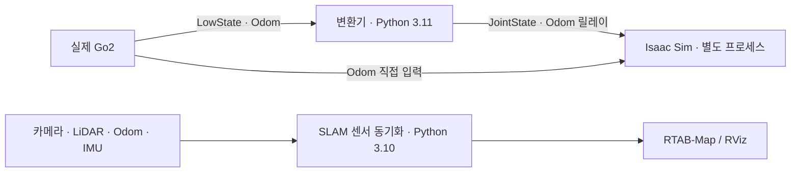

# Go2 Digital Twin & SLAM


**실제 Unitree Go2의 관절·몸체 자세를 Isaac Sim에 표시하고, 센서 데이터로 RTAB-Map 매핑을 실험하는 ROS 2 워크스페이스입니다.**

실행 코드는 용도에 따라 두 폴더로 분리되어 있습니다.

| 용도 | 시작 위치 | 실행 환경 |
| --- | --- | --- |
| 디지털 트윈 | [`go2_real/digital_twin/`](./go2_real/digital_twin/README.md) | Conda `isaaclab`, Python 3.11, Isaac Sim의 ROS 라이브러리 |
| SLAM | [`go2_real/slam/`](./go2_real/slam/README.md) | 시스템 ROS 2 Humble, Python 3.10, RTAB-Map |

디지털 트윈은 SLAM 없이 실행할 수 있습니다. 변환기와 Isaac Sim을 별도 프로세스로 실행하고,
CycloneDDS 기반 ROS 2 토픽으로 데이터를 전달합니다. 보행 제어·강화학습 학습 코드는 포함하지 않습니다.

[디지털 트윈 실행](#digital-twin) · [환경 준비](#getting-started) · [폴더 구조](#structure) ·
[SLAM 실행](#slam) · [토픽](#topics) · [문제 해결](#troubleshooting)

<a id="digital-twin"></a>

## 디지털 트윈 빠른 실행

아래 명령은 **필요한 라이브러리와 Python 3.11용 Unitree 메시지가 준비된 현재 PC 구성**을 기준으로 합니다.
새로 복제했다면 먼저 [환경 준비](#getting-started)를 확인하세요.
실제 Go2가 연결되어 `/lf/lowstate`와 `/utlidar/robot_odom`을 발행해야 합니다.

**터미널 1 — 관절 메시지 변환기**

```bash
bash "$HOME/isaac_ws/go2_real/digital_twin/run.sh" bridge
```

`/lf/lowstate`를 표준 `/joint_states`로 변환하고 Odometry를 릴레이합니다.
`Published JointState(filt)` 로그로 관절 수신·발행을 확인할 수 있습니다.

**터미널 2 — Isaac Sim**

```bash
bash "$HOME/isaac_ws/go2_real/digital_twin/run.sh" sim
```

Go2 URDF를 불러와 수신한 관절·몸체 자세를 적용합니다.
`[ODOM]`은 Odom 수신, `[POSE]`는 자세 적용 로그입니다. 관절 수신은 터미널 1의 로그도 함께 확인하세요.
각 터미널에서 `Ctrl+C`로 종료합니다.

두 명령은 작업 디렉터리와 관계없이 사용할 수 있습니다.
[`run.sh`](./go2_real/digital_twin/run.sh)가 Conda 활성화, Python·공유 라이브러리 경로,
DDS 설정을 적용하므로 별도의 `conda activate`나 시스템 ROS 환경 source가 필요하지 않습니다.

### Bash 명령 모음

| 명령 | 역할 |
| --- | --- |
| `run.sh bridge` | LowState → JointState 변환기 |
| `run.sh sim` | JointState와 Odom을 구독하는 Isaac Sim |
| `run.sh camera` | LowState 직접 구독 및 카메라 스크린 시각화 |
| `run.sh check` | Python·메시지 타입·CycloneDDS 라이브러리 로딩 검사 |
| `run.sh --help` | 사용법 |

환경만 검사할 때는 다음을 실행합니다. 로봇 연결이나 Sim의 전체 실행을 검사하는 명령은 아닙니다.

```bash
bash "$HOME/isaac_ws/go2_real/digital_twin/run.sh" check
```

현재 터미널에 환경만 적용하거나, Sim 인자를 전달할 수도 있습니다.

```bash
source "$HOME/isaac_ws/go2_real/digital_twin/env_go2_visualize.sh"

# 창 없이 실행하는 예
bash "$HOME/isaac_ws/go2_real/digital_twin/run.sh" sim --headless
```

카메라 입력, PLY 가져오기, 데이터 처리 제약은 [디지털 트윈 상세 안내](./go2_real/digital_twin/README.md)를 참고하세요.

<a id="getting-started"></a>

## 환경 준비

### 저장소와 외부 의존성

```bash
git clone https://github.com/semin-Gwon/isaac_ws.git "$HOME/isaac_ws"
```

| 항목 | 현재 구성 / 준비 사항 |
| --- | --- |
| 운영체제 | Ubuntu 22.04 |
| 시스템 ROS | ROS 2 Humble, Python 3.10; SLAM·ROS CLI용 |
| 디지털 트윈 | `$HOME/anaconda3/envs/isaaclab`, Python 3.11 |
| 시뮬레이터 | 로컬 확인 버전: Isaac Sim `5.1.0.0`, Isaac Lab Python 패키지 `0.48.5` |
| GPU | Isaac Sim과 호환되는 NVIDIA GPU·드라이버 |
| Unitree 메시지 | `src/unitree_go`를 Python 3.11용으로 빌드한 `install/unitree_go` |
| Go2 모델 | 외부 URDF와 URDF가 참조하는 메시(mesh) 파일 |
| 로봇·센서 | Go2 연결 및 필요한 카메라·LiDAR 드라이버 별도 준비 |

실행기는 설치나 빌드를 자동으로 수행하지 않습니다.
`build/`와 `install/`은 Git에서 제외되므로 새로 복제한 환경에는 포함되지 않습니다.

`src/unitree_go`에는 로봇 상태·센서 메시지 26종, `src/unitree_api`에는 API 메시지 8종이 있습니다.
빌드에는 `colcon`, `ament_cmake`, `rosidl_default_generators`, `rosidl_generator_dds_idl`이 필요합니다.
현재 디지털 트윈 실행기가 읽는 Python 패키지 위치는 다음과 같습니다.

```text
install/unitree_go/lib/python3.11/site-packages/unitree_go/
```

**Python 3.10용 메시지 빌드는 이 실행기에서 사용할 수 없습니다.**
Python 버전을 바꿔 빌드할 때는 기존 빌드 캐시·설치 결과를 구분해야 합니다.
현재 PC에는 Python 3.11용 결과가 준비되어 있으므로 바로 `run.sh check`로 확인할 수 있습니다.

ROS 설치는 [ROS 2 Humble 안내](https://docs.ros.org/en/humble/Installation/Ubuntu-Install-Debs.html),
Sim의 ROS 라이브러리는 [Isaac Sim 5.1 ROS 설치 안내](https://docs.isaacsim.omniverse.nvidia.com/5.1.0/installation/install_ros.html)를 참고하세요.

### 환경과 네트워크 설정

| 파일 | 역할 |
| --- | --- |
| [`go2_real/digital_twin/env_go2_visualize.sh`](./go2_real/digital_twin/env_go2_visualize.sh) | `isaaclab` 활성화, Python 3.11 검사, 시스템 ROS 경로 제거 후 Sim 라이브러리 지정 |
| [`scripts/env_ros2.sh`](./scripts/env_ros2.sh) | 시스템 ROS와 워크스페이스 환경 로드; SLAM·ROS CLI용 |
| [`config/cyclonedds.xml`](./config/cyclonedds.xml) | Go2와 통신할 네트워크 인터페이스 지정 |

두 환경 파일은 `source`로 사용합니다. 디지털 트윈 실행기는 자신의 환경 파일을 자동으로 불러옵니다.
ROS 설정은 `RMW_IMPLEMENTATION=rmw_cyclonedds_cpp`, `ROS_DOMAIN_ID=0`,
`ROS_LOCALHOST_ONLY=0`, 로그 경로는 `/tmp/ros_logs`입니다.

현재 DDS 인터페이스는 `eno1`입니다. `ip -br address`로 실제 연결 인터페이스를 확인하고 XML을 맞추세요.
다른 터미널이나 외부 센서 노드도 같은 domain을 사용해야 합니다.

Conda의 설치 위치가 다르면 `GO2_CONDA_ROOT`를 지정할 수 있습니다.
다만 Python 소스 안의 아래 경로는 별도로 확인해야 합니다.

| 위치 | 현재 기본값 |
| --- | --- |
| 두 시각화 스크립트의 `ros2_bridge_humble` | `/home/jnu/anaconda3/envs/isaaclab/lib/python3.11/site-packages/isaacsim/exts/isaacsim.ros2.bridge/humble/rclpy` |
| 두 시각화 스크립트의 `urdf_path` | `/home/jnu/go2_ws/src/go2_description/urdf/go2_description.urdf` |
| `tools/go2_import_ply.py`의 입력 | `/home/jnu/.ros/rtabmap_cloud.ply` |

<a id="structure"></a>

## 폴더 구조

```text
isaac_ws/
├── README.md
├── go2_real/
│   ├── digital_twin/                 # 로봇 상태 → Isaac Sim
│   │   ├── README.md
│   │   ├── run.sh                    # bridge / sim / camera / check
│   │   ├── env_go2_visualize.sh       # Python 3.11·Sim ROS 환경
│   │   ├── ros2_bridge_server.py      # LowState → JointState, Odom 릴레이
│   │   ├── go2_digital_twin.py        # 관절·몸체 자세 표시
│   │   ├── go2_visualize.py           # LowState 직접 수신·카메라 표시
│   │   └── tools/go2_import_ply.py    # 저장된 PLY → USD Points
│   └── slam/                         # 센서 입력 → 지도
│       ├── README.md
│       ├── go2_topic_sync.py
│       ├── go2_slam.launch.py
│       ├── go2_slam_lio.launch.py
│       ├── go2_sim.rviz
│       └── maps/                     # 로컬 지도 DB, Git 제외
├── config/cyclonedds.xml             # 공통 DDS 네트워크 설정
├── scripts/env_ros2.sh               # 시스템 ROS 환경
├── src/
│   ├── unitree_go/                   # 로봇 상태·센서 메시지
│   └── unitree_api/                  # API 메시지
└── docs/archive/                     # 과거 가이드·설계·작업 기록
```

기존 `go2_real/*.py`는 용도별 하위 폴더로 이동했습니다.
루트의 `env_go2_slam.sh`는 `scripts/env_ros2.sh`로, `cyclonedds.xml`은 `config/`로 이동했습니다.
개인 실행 스크립트나 기존 터미널의 `CYCLONEDDS_URI`에 이전 경로가 남아 있다면 갱신하세요.

<a id="slam"></a>

## SLAM 실행

SLAM은 디지털 트윈과 별도 시스템 ROS 터미널에서 실행합니다.
카메라·LiDAR·Odom 입력과 TF가 먼저 준비되어 있어야 합니다.

```bash
source "$HOME/isaac_ws/scripts/env_ros2.sh"
ros2 launch "$HOME/isaac_ws/go2_real/slam/go2_slam.launch.py" \
  use_lidar:=true use_viz:=true
```

RGB-D만 사용할 때는 `use_lidar:=false`를 지정합니다.
외부 LIO용 `go2_slam_lio.launch.py`는 별도의 `*_synced` 토픽을 요구하며 동기화 노드를 실행하지 않습니다.
설치, launch 인자, 토픽·TF, RViz 사용법은 [SLAM 상세 안내](./go2_real/slam/README.md)에 정리되어 있습니다.
현재 센서 동기화·좌표계 처리에는 아래의 미해결 제약이 있습니다.

<a id="topics"></a>

## 데이터 흐름과 주요 토픽



| 토픽 | 타입 | 용도 |
| --- | --- | --- |
| `/lf/lowstate` | `unitree_go/msg/LowState` | 실제 로봇 관절값 입력 |
| `/joint_states` | `sensor_msgs/msg/JointState` | 변환기가 발행하는 12개 관절의 위치 |
| `/utlidar/robot_odom` | `nav_msgs/msg/Odometry` | 실제 로봇 위치·방향 입력 |
| `/my_go2/robot_odom` | `nav_msgs/msg/Odometry` | 변환기의 원본 Odom 릴레이 |
| `/my_go2/color/image_raw[_sync]` | `sensor_msgs/msg/Image` | 카메라 포함 시각화의 RGB 입력 |

관절 순서는 FR → FL → RR → RL이며 각 다리의 hip·thigh·calf를 사용합니다.
변환기는 관절 위치에 필터를 적용하고 `velocity`·`effort`는 보내지 않습니다.
120Hz 설정은 발행 상한이며 입력을 보간해 120Hz로 만드는 기능은 아닙니다.
SLAM의 `_sync`와 외부 LIO의 `_synced` 토픽은 서로 다릅니다.

<a id="troubleshooting"></a>

## 검증 범위와 알려진 제약

Bash 문법, 인자 처리, 다른 작업 디렉터리에서의 실행, 시스템 ROS가 설정된 환경에서의 경로 교체,
ROS 메시지 4종과 CycloneDDS 라이브러리 로딩, Sim의 `--help` 실행을 확인했습니다.
전체 Isaac Sim 화면과 실제 로봇 움직임의 동시 재현, SLAM 품질을 보장하는 시험은 아직 수행하지 않았습니다.

| 증상·제약 | 확인할 내용 |
| --- | --- |
| `unitree_go` 또는 타입 지원 로딩 실패 | `run.sh check`, Python 3.11용 메시지 빌드 여부 |
| `rclpy`·공유 라이브러리 오류 | 실행기를 사용하고, 이후 시스템 ROS 환경을 다시 source하지 않았는지 확인 |
| 토픽 미수신 | Go2 연결, XML의 인터페이스, DDS domain 0 |
| 관절 지연·멈춘 자세 유지 | 필터 지연이 있으며 수신 중단 시 상태 처리가 미구현 |
| 자세 튐·잘못된 입력 | Odom 여러 소스 혼용, 시간 순서·NaN 검증 부족 |
| 카메라 화면 없음 | `/camera/color/image_raw`는 직접 구독하지 않음. 행 패딩 처리와 OpenCV 저장 경로 결함도 남아 있음 |
| SLAM 동기화 실패 | 센서별 시각 기준, LiDAR 프레임, RGB·Depth 정렬·매칭 문제 |

이 실행기는 환경 설정을 정리한 것이며 기존 관절·센서 처리 로직을 수정하지 않습니다.
세부 제약은 각 기능 폴더의 README에서 확인하세요.

## 생성 파일과 이전 문서

지도 DB는 `go2_real/slam/maps/`에 저장합니다. RGB-D 모드는 `rtabmap_real.db`, 외부 LIO 모드는
`rtabmap_real_lio.db`를 사용합니다. 기존 지도는 보존하며 Git에는 포함하지 않습니다.

`build/`, `install/`, 로그, `outputs/`, 생성된 에셋·체크포인트, Python 캐시, 지도 DB·PLY/PCD,
ROS bag은 [`.gitignore`](./.gitignore)로 제외합니다. 새로 복제한 환경에서는 별도 준비가 필요합니다.

[`docs/archive/`](./docs/archive/)에는 이전
[Isaac Sim 가이드](./docs/archive/GO2_ISAACSIM_ROS2_GUIDE.md),
[RTAB-Map 가이드](./docs/archive/GO2_RTABMAP_GUIDE.md),
[설계 계획](./docs/archive/plan.md), [작업 기록](./docs/archive/TASKS.md)을 보관합니다.
과거 문서에는 현재 없는 스크립트와 이전 설정이 남아 있으므로 실행 명령은 현재 README를 기준으로 합니다.

## 라이선스와 문의

프로젝트 전체에 적용하는 루트 라이선스 파일은 아직 없습니다.
포함된 Unitree 패키지는 각각 [`unitree_go/LICENSE`](./src/unitree_go/LICENSE),
[`unitree_api/LICENSE`](./src/unitree_api/LICENSE)의 BSD 3-Clause 조건을 따릅니다.

문제나 개선 제안은 [GitHub Issues](https://github.com/semin-Gwon/isaac_ws/issues)에 남겨 주세요.
사용한 실행 명령, Python·ROS·Isaac Sim 버전, 입력 토픽과 오류 로그를 함께 기록하면 재현에 도움이 됩니다.
