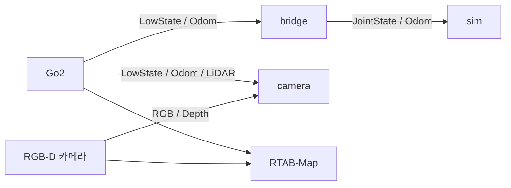

# Go2 Digital Twin & SLAM

실제 Go2 → Isaac Sim 시각화 · RTAB-Map 지도 생성

<a id="getting-started"></a>

## Quick Start

- 기준: `~/isaac_ws` · [환경 설치 완료](./docs/setup.md) · 로봇·센서 발행 중
- 디지털 트윈: `camera` 또는 `bridge + sim` 중 하나
- 종료: 각 터미널에서 `Ctrl+C`

<a id="digital-twin"></a>

### Digital Twin · 카메라 포함

```bash
bash "$HOME/isaac_ws/go2_real/digital_twin/run.sh" camera
```

- 터미널 1개 · 별도 변환기 불필요
- 관절·자세·RGB 표시 / 뎁스·LiDAR 수신 진단

### Digital Twin · 관절·자세만

#### 터미널 1 — 변환기

```bash
bash "$HOME/isaac_ws/go2_real/digital_twin/run.sh" bridge
```

#### 터미널 2 — Isaac Sim

```bash
bash "$HOME/isaac_ws/go2_real/digital_twin/run.sh" sim
```

<a id="slam"></a>

### SLAM · RGB-D + LiDAR

```bash
source "$HOME/isaac_ws/scripts/env_ros2.sh"
ros2 launch "$HOME/isaac_ws/go2_real/slam/go2_slam.launch.py" \
  use_lidar:=true use_viz:=true
```

- 별도 시스템 ROS 터미널
- RGB-D만 사용: `use_lidar:=false`

## 실행 영상

[](https://youtu.be/HpQZ3kfetH0)

<a id="topics"></a>

## 전체 구성



- 통신: ROS 2 / CycloneDDS
- 디지털 트윈·SLAM: 독립 실행

<a id="structure"></a>

## 상세 문서

| 문서 | 내용 |
| --- | --- |
| [디지털 트윈](./go2_real/digital_twin/README.md) | 실행 모드·토픽·센서 진단 |
| [SLAM](./go2_real/slam/README.md) | RViz·외부 LIO·지도 저장 |
| [환경 설정](./docs/setup.md) | 설치 조건·경로·DDS |
| [이전 기록](./docs/archive/) | 과거 설정·실험 기록 |

<a id="troubleshooting"></a>

## 참고

- 라이선스: [unitree_go](./src/unitree_go/LICENSE)·[unitree_api](./src/unitree_api/LICENSE) — BSD 3-Clause / 프로젝트 전체 — 미지정
- 문의: [GitHub Issues](https://github.com/semin-Gwon/isaac_ws/issues)
