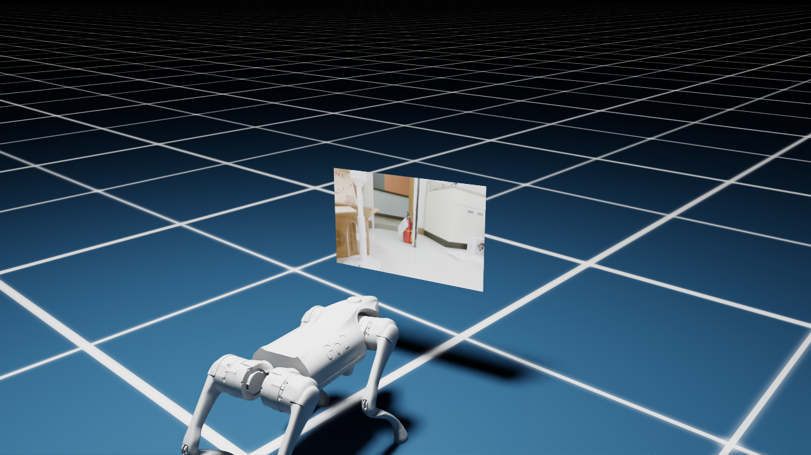

# Go2 디지털 트윈

## Quick Start

- 기준: `~/isaac_ws` · [환경 설치 완료](../../docs/setup.md) · 로봇·카메라 발행 중
- 모드: `camera` / `bridge + sim` 중 하나 · 종료: `Ctrl+C`

### 카메라 포함 · 터미널 1개

```bash
bash "$HOME/isaac_ws/go2_real/digital_twin/run.sh" camera
```

### 관절·자세만 · 터미널 2개

#### 터미널 1 — 변환기

```bash
bash "$HOME/isaac_ws/go2_real/digital_twin/run.sh" bridge
```

#### 터미널 2 — Isaac Sim

```bash
bash "$HOME/isaac_ws/go2_real/digital_twin/run.sh" sim
```

### 센서 수신 검사 · 선택

```bash
bash "$HOME/isaac_ws/go2_real/digital_twin/run.sh" sensors --seconds 10
```

- 뎁스·LiDAR 검사 후 자동 종료
- Sim 실행 없음 · 관절 변환 기능 없음

## 실행 모드

| 모드 | 관절 입력 | 표시 | 변환기 |
| --- | --- | --- | --- |
| `camera` | `unitree_go/msg/LowState` | 관절·자세·RGB | 불필요 |
| `sim` | `sensor_msgs/msg/JointState` | 관절·자세 | `bridge` 필수 |

- `camera`: `/lf/lowstate` 직접 수신 · `/joint_states` 미구독
- 스크린: 로봇 전방 배치 · 로봇 쪽을 향한 화면 · 메모리 텍스처
- 뎁스·LiDAR: 수신·진단 지원 / 화면 표시 미구현

## 입력 토픽

| 데이터 | 기본 토픽 | 변경 옵션 |
| --- | --- | --- |
| 관절 | `/lf/lowstate` | — |
| 자세 | `/utlidar/robot_odom` | — |
| RGB | `/camera/color/image_raw` | `--camera-topic` |
| 뎁스 | `/camera/aligned_depth_to_color/image_raw` | `--depth-topic` |
| LiDAR | `/utlidar/cloud_base` | `--lidar-topic` |

- 옵션 위치: `run.sh camera --camera-topic 토픽명`
- 뎁스: `16UC1`(mm)·`32FC1`(m) → m 단위 배열
- LiDAR: 유효 XYZ 배열 · 원본 좌표계·헤더 유지

## 진단 로그

| 표시 | 의미 |
| --- | --- |
| `[DIAG]` | RGB 수신 횟수·`texture_updates` 증가 여부 |
| `[DEPTH]` / `[LIDAR]` | 수신 Hz·경과 시간·좌표계·유효 값 |
| `OK` / `WAITING` | 정상 수신 / 미수신 |
| `STALE` / `EMPTY` / `ERROR` | 2초 이상 중단 / 유효 값 없음 / 해석 오류 |

- 검사 성공: 양쪽 `OK` + 오류 0 → `PASS`, 종료 코드 0
- 검사 실패: 그 외 → `FAIL`, 종료 코드 1

## 실행 영상

[YouTube에서 보기 →](https://youtu.be/HpQZ3kfetH0)

<details>
<summary>실제 실행 화면</summary>



</details>

## 검증·제약

- 로컬 검증: 2026-09-22
- 카메라 렌더링 60초 · 화면 방향 확인 20초 · [테스트 11개](./tests/)

| 범위 | 제약 |
| --- | --- |
| 관절·자세 | NaN·quaternion·관절 누락 검증 부족 / 수신 전 0·중단 후 마지막 자세 유지 |
| `sim` | 다중 Odom 혼용·공유 상태 잠금 없음 |
| 브릿지 | 관절·Odom 시점 불일치 가능 / 관절 발행 상한 120Hz |
| RGB | 행 패딩 미지원 |
| 뎁스·LiDAR | 렌더링·TF 변환·센서 간 시간 동기화 미구현 |
| PLY | 고정 31-byte 구조 / 손상된 헤더의 EOF 처리 부족 |

<details>
<summary>개발 참고 · 파일·테스트</summary>

| 파일 | 역할 |
| --- | --- |
| [run.sh](./run.sh) · [env_go2_visualize.sh](./env_go2_visualize.sh) | 실행·Conda/ROS/DDS 환경 설정 |
| [go2_visualize.py](./go2_visualize.py) | `camera` |
| [go2_digital_twin.py](./go2_digital_twin.py) | `sim` |
| [ros2_bridge_server.py](./ros2_bridge_server.py) | LowState → JointState·Odom 릴레이·TF |
| [sensor_subscriptions.py](./sensor_subscriptions.py) | 센서 해석·진단 |
| [go2_import_ply.py](./tools/go2_import_ply.py) | PLY → USD Points |

- 관절 순서: FR → FL → RR → RL / hip·thigh·calf
- 변환기 출력: 필터링한 각도·`/my_go2/robot_odom`·`/tf` / 속도·토크 제외
- PLY: `ply_file_path` 설정 후 Isaac Sim Script Editor 실행
- 공용 생성 파일: `/tmp/go2.usd`

```bash
source "$HOME/isaac_ws/go2_real/digital_twin/env_go2_visualize.sh"
"$GO2_PYTHON" -m unittest discover -s "$GO2_WS/go2_real/digital_twin/tests" -v
```

</details>

[메인](../../README.md) · [환경 설정](../../docs/setup.md) · [SLAM](../slam/README.md)
